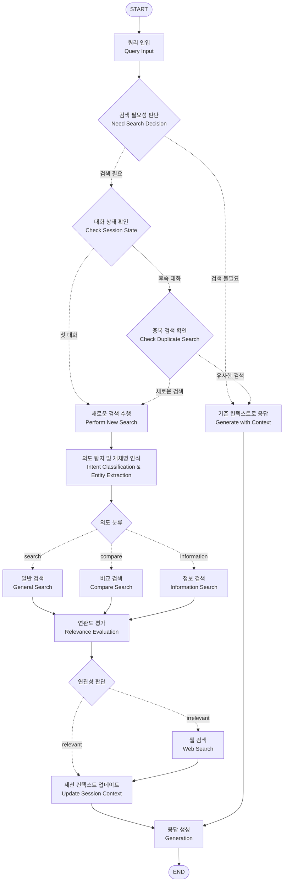

# 1. 소개

원하는 식당을 검색하고 식당에 관한 질의응답을 할 수 있는 LLM 에이전트 실습

<br>

# 2. 데이터 크롤링

1. 네이버 개발자센터에서 제공하는 지역검색 API를 사용해서 검색할 키워드 수집
   - 장소명
     - gemini-2.5-pro 모델에 서울/경기도 행정동 이름, 서울/경기도 지하철역, 서울/경기도 번화가 지명을 뽑아달라고 요청해서 장소명 목록 생성
   - 음식 메뉴명
     - 배달의민족, 네이버, 요기요 등에서 사람들이 주요한 메뉴 목록 생성

(장소명) + (메뉴명) 모든 조합으로 네이버 지역 검색 API 호출해서 식당정보를 수집한다. ex) 강남역 국밥

네이버 지역검색 API는 아래와 같이 장소명, 음식 카테고리, 주소, 좌표 정도만 제공함

```json
{
  "title": "농민백암순대 본점",
  "category": "한식>순대,순댓국",
  "description": "",
  "telephone": "",
  "address": "서울특별시 강남구 대치동 896-33",
  "roadAddress": "서울특별시 강남구 선릉로86길 40-4",
  "mapx": "1270530139",
  "mapy": "375037000"
}
```

2. 네이버 지도 크롤링

네이버 지역검색 API로 모은 데이터를 사용해서 특정 식당 검색 후 메뉴, 리뷰, 업체소개를 크롤링으로 수집했다.

네이버 지도로 (식당명) + ('동' 까지의 행정구역) 키워드로 검색하면 웬만하면 식당 목록이 아닌 특정 식당 상세 페이지가 바로 나오기 때문에 크롤링 하기가 수월하다.
ex) 검색어: '농민백암순대 본점 서울특별시 강남구 대치동'

- 최종 생성 문서 예시

```json
{
    "place_id": "1993900101",
    "search_keyword": "우드멜로우 서울특별시 강동구 아리수로",
    "title": "우드멜로우",
    "category": "음식점>카페,디저트",
    "address": "서울특별시 강동구 고덕동 482",
    "roadAddress": "서울특별시 강동구 아리수로 243",
    "mapx": "1271551201",
    "mapy": "375630641",
    "menus": [
        {"name": "멜란자네파다노", "price": "20,000원"},
        {"name": "냉파스타(여름시즌한정)", "price": "17,500원"},
        {"name": "올리브 피칸테 엔쵸비", "price": "18,000원"},
        {"name": "클래식 까르보나라", "price": "19,000원"},
        {"name": "알리오올리오", "price": "18,000원"},
        {"name": "뽈로바질파스타", "price": "23,000원"},
        "(...줄임)"
    ],
    "reviews":
    [
        "우드멜로우에서 브런치를 즐기고 왔어요. 긴 테이블이 있어서 부모님과 여럿이 함께 앉기 편했어요. 창밖 경치도 좋아서 여유롭게 식사하기 좋은 공간이에요. 다양한 브런치 메뉴를 골라서 먹었는데, 전체적으로 음식이 맛있고 디저트류까지 구성이 다양해서 골라 먹는 재미가 있었어요. 다만 아쉬웠던 점은, 음식을 직접 받아서 엘리베이터 타고 올라가야 하는 구조인데 그릇이 꽤 무겁고 메뉴가 많다 보니 여러 번 나눠 옮겨야 했어요. 직원분들도 친절하고 음식도 만족스러웠던 만큼, 그 부분만 개선되면 훨씬 더 쾌적한 경험이 될 것 같아요.",
        "브런치 먹을만한 곳을 찾다가 오픈시간도 9시 30분이고 거리도 가까워서 와봤는데 브런치 메뉴가 정말 맛있네요 💯\n퀄리티도 좋고 흔히 볼수 있는데 메뉴가 아닌 색다른 메뉴들이 많더라구요 🥰\n세트메뉴 있는걸 모르고 주문했는데 친절히 알려주셔서 조금 더 착한 가격으로 든든하게 브런치 먹고 왔습니다\n또 방문할게요 ~!!",
        "인테리어가 너무 멋져서 사진이 잘 나와요\n메뉴도 다양하고 맛잇어서 너무 만족스러웠네요\n첫방문인데 앞으로 자주 오게 될 것 같아요😊👍🏻",
        "강동 최애 커피 & 파스타 맛집이에요!!\n신메뉴 가지 토스트 요리 (이름이 길어서 기억안나요ㅠ) 직원분이 추천해주셔서 먹어봤는데\n너무 맛있어요 ㅋㅋ\n가지도 많이 넣어주시고 잠봉햄도 조화가 좋아요.\n부모님도 맛있다고 하셨어요❤️\n즐거운 식사 시간이었어요. 또 올께요~~"
        "(...줄임)"
    ],
    "description": "예쁘고 편안한 공간에서 맛있는 커피와 브런치를 즐겨보세요 :)"
}
```

참고로 mapx, mapy는 WGS84 좌표계, 즉 우리가 일반적으로 알고있는 위도 경도이다. mapx, mapy 각각 앞 2자리, 3자리를 정수부로하고 나머지를 소부부로 치환해서 실수로 변경하면 경도 위도가 된다. 이렇게 해서 좌표로 주소를 검색해보면 정확히 해당 주소가 나온다.

이것은 아직 문서의 최종 형태는 아니다. 아래에 설명하겠지만, 식당소개글과 사용자 리뷰를 가지고 LLM으로 추가 피쳐를 추출해서 내용을 더 풍부하게 해주고 임베딩을 추출한다.

<br>

# 3. 흐름도(Flow Chart)



### 1. 쿼리 인입(Natural Language Query Input)

사용자가 입력한 질의가 시스템 입력으로 인입. 어떠한 가공도 되지 않은 자연어 형태로, 기계가 이해하기 쉬운 형태로 변형이 필요한 텍스트이다.

### 2. 검색 필요성 판단(Need Search Decision)

LLM이 현재 사용자 메시지, 이전 검색 기록, 대화 히스토리를 분석하여 새로운 검색이 필요한지 판단하는 단계이다. 

검색이 필요한 경우:
- 완전히 다른 지역이나 음식 종류를 요청
- 기존 검색 결과에 만족하지 못하고 다른 옵션을 원함
- 이전 검색과 전혀 관련 없는 새로운 맛집 정보를 요청

검색이 불필요한 경우:
- 기존 검색 결과에 포함된 특정 식당에 대한 추가 질문
- 기존 추천 맛집 중 선택이나 비교 요청
- 일반적인 대화나 감사 인사

### 3. 대화 상태 확인(Check Session State)

세션 매니저를 통해 현재 대화가 첫 번째 대화인지 후속 대화인지 확인하는 단계이다.

### 4. 중복 검색 확인(Check Duplicate Search)

후속 대화에서 새로운 검색이 필요한 경우, 기존 검색 기록과 유사도를 비교하여 중복 검색을 방지하는 단계이다.

### 5. 새로운 검색 수행(Perform New Search)

실제로 새로운 검색을 수행하는 단계로, 의도 탐지 및 개체명 인식 → 검색 실행 → 컨텍스트 업데이트 과정을 거친다.

### 6. 의도 탐지 및 개체명 인식(Intent Classification & Entity Extraction)

입력된 자연어 쿼리에서 검색 의도(search/compare/information)를 분류하고 필요한 엔티티를 추출하는 NLU(Natural Language Understanding) 단계. Gemini 2.5 Flash Lite 모델을 사용하여 정확한 의도 파악과 엔티티 추출을 수행한다.

### 7. 의도 분류

NLU 결과에 따라 적절한 검색 전략을 선택하는 분기점이다.
- **search**: 일반적인 맛집 검색 → 일반 검색 전략
- **compare**: 여러 식당 비교 → 비교 검색 전략  
- **information**: 특정 식당 정보 요청 → 정보 검색 전략

### 8. 일반 검색(General Search)

포괄적인 맛집 검색을 위한 전략으로, 추출된 모든 엔티티를 활용한다. 지역 필터, 카테고리 필터, 메뉴 필터, 편의시설 필터를 적용하여 3개 문서를 검색한다.

### 9. 비교 검색(Compare Search)

여러 식당을 비교하기 위한 전략으로, 각 식당명에 대해 개별 쿼리를 실행한다. 각 쿼리당 2개씩 문서를 검색하여 비교 대상을 확보하고 중복을 제거한다.

### 10. 정보 검색(Information Search)

특정 식당에 대한 상세 정보를 제공하기 위한 전략이다. 식당명이 있는 경우 정확한 매칭을 우선하고, 지역만 있는 경우 더 많은 결과(5개)를 반환한다.

### 11. 연관도 평가(Relevance Evaluation)

검색된 문서들이 사용자 질의에 얼마나 관련성이 있는지 LLM을 사용해 평가하는 단계이다. Gemini 2.5 Flash Lite로 각 문서를 'relevant'/'irrelevant'로 판단하여 관련성이 높은 문서만 필터링한다.

### 12. 연관성 판단

연관도 평가 결과에 따라 다음 단계를 결정하는 분기점이다.
- **relevant**: 관련성이 높은 문서들이 발견된 경우 → 세션 컨텍스트 업데이트로 진행
- **irrelevant**: 모든 문서가 관련성이 낮은 경우 → 웹 검색으로 대체

### 13. 웹 검색(Web Search)

식당 데이터베이스에서 관련성 높은 결과를 찾지 못한 경우, Tavily API를 사용하여 웹에서 관련 정보를 검색하는 단계이다. 웹 검색 결과도 세션 컨텍스트에 저장된다.

### 14. 세션 컨텍스트 업데이트(Update Session Context)

연관도 평가를 통과한 검색 결과 또는 웹 검색 결과를 세션 매니저에 저장하여 후속 대화에서 재사용할 수 있도록 하는 단계이다.

### 15. 기존 컨텍스트로 응답(Generate with Context)

새로운 검색 없이 이전에 저장된 검색 결과와 대화 히스토리를 활용하여 응답을 생성하는 단계이다.

### 16. 응답 생성(Generation)

유저의 자연어 질의와 검색된 문서(또는 기존 컨텍스트)를 하나의 컨텍스트로 구성하여 LLM에 응답 생성을 요청한다.

<br>

# 4. 의도 탐지 및 개체명 인식(Intent Classification & Entity Extraction)

자연어 쿼리에서 검색 의도를 분류하고 필요한 엔티티를 추출하는 NLU(Natural Language Understanding) 단계이다. Gemini 2.5 Flash Lite 모델을 사용하여 구조화된 JSON 형태로 결과를 생성한다.

### 의도 분류

- `search`: 일반적인 검색 (예: "강남역 일식집 추천", "주차되는 식당")
- `compare`: 여러 식당 비교 (예: "A와 B 중 어디가 더 맛있어?", "버거킹과 맥도날드 비교")  
- `information`: 특정 식당 정보 요청 (예: "진대감 영업시간", "버거킹 메뉴")

### 엔티티 추출

- `location`: 위치 정보 (지역명, 식당명. 예: 정자역, 마포)
- `title`: 식당명 (비교나 정보 요청 시 중요)
- `menu`: 메뉴명(예: 국밥, 치킨, 회, 돈가스, 파스타)
- `category`: 식당 카테고리(예: 한식, 일식, 중식, 양식, 퓨전요리)
- `convenience`: 편의사항(주차|발렛|배달|포장|예약|룸|콜키지|반려동물|와이파이|24시|구워줌)
- `atmosphere`: 분위기(예: 이국적인, 색다른, 로맨틱한)
- `occasion`: 상황(예: 회식, 단체, 데이트, 혼밥, 가족)

### NLU 처리 결과 예시

> 예시 1) query: "강남역 주차되는 일식집"

```json
{
  "intent": "search",
  "entities": {
    "location": ["강남역"],
    "category": ["일식"],
    "convenience": ["주차"]
  }
}
```

> 예시 2) query: "버거킹과 맥도날드 중 어디가 더 맛있어?"

```json
{
  "intent": "compare", 
  "entities": {
    "title": ["버거킹", "맥도날드"]
  }
}
```

> 예시 3) query: "마포 진대감 주차되나요?"

```json
{
  "intent": "information",
  "entities": {
    "location": ["마포"],
    "title": ["진대감"],
    "convenience": ["주차"]
  }
}
```

> 예시 4) query: "조용히 대화할 수 있는 맥주집"

```json
{
  "intent": "search",
  "entities": {
    "menu": ["맥주"],
    "atmosphere": ["조용한"]
  }
}
```

> 예시 5) query: "홍대에 회식하기 좋은 삼겹살집 추천해줘"

```json
{
  "intent": "search",
  "entities": {
    "location": ["홍대"],
    "menu": ["삼겹살"],
    "occasion": ["회식"]
  }
}
```

추출된 엔티티 중 `location`, `title`, `category`, `menu`, `convenience`는 Elasticsearch 필터링에 사용되고, `atmosphere`, `occasion`은 벡터 검색에서 의미적 유사도 계산에 활용된다.

<br>

# 5. 검색용 문서(Document) 생성

### 1. 크롤 문서 전처리

1. 카테고리 정리

요리 종류만 남기고 메뉴명은 제거한다. ex) "한식>전,빈대떡" - "한식"

2. 가격을 숫자로 변환

텍스트로 표현된 가격(`menu.price`)을 정수로 변환한다.(ex. "20,000원" -> 20000)

3. 위도, 경도 실수로 변환

`x`: `mapx`에서 앞 세 자리를 정수부, 뒷부분을 소수부로 한 소수로 변환(ex. "1271551201" -> 127.155120)
`y`: `mapy`에서 앞 두 자리를 정수부, 뒷부분을 소수부로 한 소수로 변환(ex. "375630641" -> 37.563064)

### 2. 리뷰와 식당 설명으로부터 추가 정보 추출

LLM을 사용해서 리뷰(`reviews`)와 식당 설명(`description`)에서 다음의 추가적인 정보를 추출한다.

- `review_food`: 리뷰에서 추출한 요리, 음식 관련 키워드. 크롤링한 식당 필드에도 `menu`가 이미 있지만 리뷰에서 더 풍부한 키워드 추출.
- `convenience`: 편의(예: 주차, 배달, 포장, 예약, 룸, 반려동물, 고기구워줌 등)
- `atmosphere`: 분위기(예: 이국적인, 색다른, 로맨틱한 등)
- `occasion`: 상황(예: 회식, 단체, 데이트, 혼밥, 가족 등)
- `features`: 기타 특징(예: 넓은공간, 창가뷰, 방송출연(프로그램명), 유명인 이름, 주변 장소 등)

### 3. 임베딩을 위한 `summary` 필드 생성

임베딩을 추출하기 위해 식당 관련 내용을 요약한 단 하나의 텍스트 필드(`summary`)를 생성한다.

```python
summary = f"""
식당 이름: {title}
카테고리: {category}
주소: {address}({roadAddress)}
메뉴: {",".join(menus + review_food)}
f"편의: {','.join(convenience) if convenience else None}"
f"분위기: {','.join(atmosphere) if atmosphere else None}"
f"상황: {','.join(occasion) if occasion else None}"
f"기타 특징: {','.join(features) if features else None}"
"""
```

### 4. 임베딩 추출

`summary` 텍스트로부터 임베딩을 추출한다.

최종적으로 아래와 같은 구조의 식당 문서를 생성한다.

```json
{
  "title": "식당명",
  "category": "카테고리",
  "address": "주소",
  "roadAddress": "도로명주소",
  "menus": "메뉴",
  "lat": "위도",
  "lon": "경도",
  "reviews": "리뷰",
  "description": "소개",
  "review_food": "리뷰에서 추출한 요리",
  "convenience": "편의",
  "atmosphere": "분위기",
  "occasion": "상황",
  "features": "기타 특징",
  "summary": "요약",
  "embedding": "임베딩"
}
```

### 5. 최종 문서 예시

```json
{
    "place_id": "38010856",
    "title": "마미손빈대떡,생선구이,오리구이",
    "category": "한식",
    "address": "서울특별시 송파구 가락동 87 유일빌딩 1층 마미손빈대떡",
    "roadAddress": "서울특별시 송파구 중대로9길 50 유일빌딩 1층 마미손빈대떡",
    "lat": 37.4971191,
    "lon": 127.1194978,
    "menus":
    [
        {
            "name": "오리로스구이(한마리)",
            "price": 57000
        },
        {
            "name": "양념게장정식+된장찌개(1인분)",
            "price": 10000
        },
        {
            "name": "모듬전+김치찌개",
            "price": 38000
        },
        {
            "name": "모듬전",
            "price": 35000
        },
        {
            "name": "생선모듬구이(중)",
            "price": 35000
        },
        {
            "name": "갈치조림(대)",
            "price": 40000
        },
        "(...줄임)"
    ],
    "reviews":
    [
        "회사근처 맛집으로 자주 왔는데 리모델링해서 매장이 훨씬 넓고 쾌적해졌어요 원래도 어머님 솜씨조으셔서 맛있는데 더 맛집이 되었네요^^\n일상적인 점심식사도 훌륭하고 모듬전 및 안주류에 술한잔 하기도 좋은 곳이에요\n저의 추천은 모듬전과 볶음류 양념맛이 너무 조아요",
        "리모델링하고 새로운메뉴가 생겼네요\n오리로스구이랑 탕이 세트로 나오는데\n깔끔하니 맛있었어요",
        "비가 오면 무조건 생각나는 부칭개에 막걸리.\n비오는 날이면 생각나는 마미손빈대떡.\n오랜만에 비가와서 들렀더니 리뉴얼을 해버렸네.\n예전엔 선술집 같은 느낌이었는디 깔끔하게 리뉴얼 했다.\n아직 간판도 안달았는데 영업을 하고 있었다는~~\n거기에 손님이 이미 꽉 차서 시끌시끌 하더라.\n맛은 전혀 변함이 없고 친철한 서비스도 그대로다.\n거기에 주변 부칭개집보다 가성비까지 여전하다.\n이러니 사람들이 다시 찾아오지.\n비오는날 부칭개는 마미손부칭개(빈대떡)!!!\n다시 방문 하고싶은 마음 50,000%",
        "고등어구이 맛집이예요!! 고등어뿐 아니라~ 다양한 메뉴가 많은데요! 다~ 맛탱!! 가락동에 찐 단골집입니다.\n이번에 신메뉴~ 양념게장! 맛도리네요!\n다음엔 양념게장정식으로 먹어야겠어요.👍",
        "오리탕빼고 너~~무너무맘에들어요!!!",
        "(...줄임)"
    ],
    "description": "매일 신선하고 맛있는 음식으로 최선을 다해 준비하고 있습니다.\n\n요일별 특별반찬 메뉴가 있습니다.\n(총 반찬 5가지 제공)\n\n(김치,나물,샐러드,계란말이,특별반찬)\n\n요일 특별반찬\n월(장조림) 화(잡채) 수(게장) 목(쏘세지야채볶음) 금(동그랑땡) 토(게장)\n\n재오픈 리뉴얼오픈기념\n\n2025년7월31일까지 양념게장 정식을 10,000에 판매합니다.",
    "review_food": ["모듬전", "부침개", "빈대떡", "오리로스구이", "오리탕", "양념게장", "고등어구이", "제육볶음", "파전", "김치전"],
    "convenience": ["주차", "포장"],
    "atmosphere": ["넓은 공간", "쾌적한", "시끌벅적한"],
    "occasion": ["점심식사", "회식", "술자리", "모임", "가족"],
    "features": ["가성비", "친절한", "방송출연", "신메뉴", "리뉴얼", "요일별 특별반찬"],
    "summary": "식당 이름: 마미손빈대떡,생선구이,오리구이\n카테고리: 한식\n주소: 서울특별시 송파구 가락동 87 유일빌딩 1층 마미손빈대떡(서울특별시 송파구 중대로9길 50 유일빌딩 1층 마미손빈대떡)\n메뉴: 오리로스구이(한마리),양념게장정식+된장찌개(1인분),모듬전+김치찌개,모듬전,생선모듬구이(중),갈치조림(대),고등어구이+된장찌개(1인분),노르웨이고등어구이+된장찌개(1인분),가자미구이+된장찌개(1인분),임연수구이+된장찌개(1인분),갈치구이+된장찌개(1인분),오징어볶음+된장찌개(2인분),해물파전,굴전(계절메뉴),동그랑땡,동태전,깻잎전,고추전,감자전,부추전,김치전,호박전,두부전,닭볶음탕,가오리찜,홍어회,어리굴젓,계란말이,구룡포과메기(계절메뉴),꼬막데침(계절메뉴),꼬막간장(계절메뉴),생굴(계절메뉴),생선모듬구이(대),조기구이,갈치조림(중),고등어조림(중),고등어조림(대),삼치구이+된장찌개(1인분),제육볶음+된장찌개(2인분),김치찌개(2인분),부대찌개(2인분),알탕(2인분),동태탕(2인분),조기매운탕(2인분),생대구탕(2인분),모듬전,부침개,빈대떡,오리로스구이,오리탕,양념게장,고등어구이,제육볶음,파전,김치전\n편의: 주차,포장\n분위기: 넓은 공간,쾌적한,시끌벅적한\n상황: 점심식사,회식,술자리,모임,가족\n기타 특징: 가성비,친절한,방송출연,신메뉴,리뉴얼,요일별 특별반찬",
    "embedding":
    [
        -0.028949551279472147,
        -0.0017396338291416917,
        0.03168854535716604,
        -0.10113728714514654,
        (...줄임)
    ]
}
```

<br>

# 6. 의도별 검색 전략

NLU 모듈에서 분류된 의도에 따라 다른 검색 전략을 적용한다.

### Search 의도
일반적인 맛집 검색으로, 추출된 모든 엔티티를 활용하여 포괄적인 검색을 수행한다.
- `location`: 지역 필터 (coordinates 인덱스에서 위도/경도 조회 후 geo_distance 쿼리)
- `category`: 카테고리 필터 (정확한 매칭)
- `menu`: 메뉴 필터 (메뉴명과 리뷰 음식에서 검색)
- `convenience`: 편의시설 필터 (필수 조건)
- `atmosphere`, `occasion`: 벡터 검색으로 의미적 유사도 반영

### Compare 의도  
여러 식당을 비교하는 검색으로, 각 식당별로 개별 쿼리를 실행한다.
- `title` 엔티티의 각 식당명에 대해 별도 검색 실행
- 각 쿼리당 2개씩 문서 검색하여 비교 대상 확보
- 중복 제거 후 최종 결과 반환

### Information 의도
특정 식당에 대한 정보 요청으로, 정확한 매칭에 중점을 둔다.
- `title`이 있는 경우: 해당 식당명으로 정확한 검색
- `location`만 있는 경우: 지역 기반 검색으로 더 많은 결과(5개) 반환

### 연관성 평가 및 필터링
모든 검색 결과는 LLM 기반 연관성 평가를 거쳐 관련성이 높은 문서만 필터링된다.
- Gemini 2.5 Flash Lite로 각 문서의 관련성을 'relevant'/'irrelevant'로 판단
- 'relevant' 문서만 최종 결과로 반환

### 쿼리 처리 예시

1. 자연어 질의: "강남역 주차되는 일식집"
2. NLU 결과:
```json
{
  "intent": "search",
  "entities": {
    "location": ["강남역"],
    "category": ["일식"], 
    "convenience": ["주차"]
  }
}
```

3. 최종 Elasticsearch 쿼리:
```python
{
    "knn": {
        "field": "embedding",
        "query_vector": embedding,
        "k": 3,
        "num_candidates": 100,
        "filter": [
            {
                "geo_distance": {
                    "distance": "3km",
                    "pin.coordinate": {
                        "lat": 37.497952,  # 강남역 위도
                        "lon": 127.027619  # 강남역 경도
                    }
                }
            },
            {
                "match": {
                    "convenience": {
                        "query": "주차",
                        "operator": "and"
                    }
                }
            },
            {
                "match": {
                    "category": {
                        "query": "일식",
                        "operator": "and"
                    }
                }
            }
        ]
    },
    "size": 3
}
```

<br>

# 7. 벡터 데이터베이스 및 검색 시스템

NLU 기반 의도별 검색과 LLM 연관성 평가가 통합된 하이브리드 검색 시스템을 구현한다.

### Elasticsearch 선택 이유
- 키워드 매칭, 필터링, 벡터 검색을 모두 지원하는 통합 플랫폼
- 지리 기반 검색(geo_distance)으로 위치 중심 맛집 검색 가능
- 의도별로 다른 검색 전략을 유연하게 구현 가능
- KNN 벡터 검색과 필터 조건을 결합한 복합 쿼리 지원

### 검색 파이프라인
1. **NLU 처리**: 자연어 → 의도분류 + 엔티티추출
2. **전략 선택**: 의도별 검색 전략 (search/compare/information)
3. **쿼리 생성**: 엔티티 기반 Elasticsearch 쿼리 구성
4. **검색 실행**: 벡터 유사도 + 키워드 필터링 통합 검색
5. **연관성 평가**: LLM으로 검색 결과의 관련성 판단 및 필터링

<br>

# 8. 연관도 평가(Relevance Evaluation)

검색된 문서들이 사용자의 질의에 얼마나 관련성이 있는지 LLM을 활용해 평가하고 필터링하는 단계이다.

### 평가 방식
- **모델**: Gemini 2.5 Flash Lite 사용
- **평가 기준**: 'relevant' (관련있음) / 'irrelevant' (관련없음)
- **평가 범위**: 전체 연관성 + 개별 문서별 연관성

### 평가 과정
1. **문서 구조화**: 검색된 각 문서의 핵심 정보(식당명, 주소, 메뉴, 편의시설 등) 추출
2. **프롬프트 생성**: 사용자 질의와 문서 정보를 포함한 평가 프롬프트 구성
3. **LLM 평가**: 각 문서의 관련성과 전체적인 연관도 판단
4. **결과 필터링**: 'relevant'로 판정된 문서만 최종 결과로 반환

### 평가 결과 구조
```json
{
  "overall_relevance": "relevant" | "irrelevant",
  "reason": "전체 판단 근거",
  "document_scores": [
    {
      "document_id": "1",
      "relevance": "relevant" | "irrelevant", 
      "reason": "개별 문서 판단 근거"
    }
  ]
}
```

### 필터링 로직
- `overall_relevance`가 'relevant'인 경우에만 결과 반환
- 개별 문서 중 'relevant'로 판정된 것들만 선별
- 모든 문서가 'irrelevant'인 경우 빈 결과 반환

이를 통해 검색 정확도를 높이고 사용자에게 더 관련성 높은 맛집 정보만 제공할 수 있다.

<br>

# 9. 답변 생성

1. 엘라스틱서치 검색결과 문서 구조

```json
[
    {
        "place_id": "13158894",
        "summary": "식당 이름: 진대감 가락점\n주소: 서울특별시 송파구 가락동 83-7(서울특별시 송파구 중대로9길 34)\n메뉴: 한우차돌삼합(29000원),한우투뿔모듬(No.9)(119000원),한우파김치전골(55000원),한우차돌박이(29000원),점심)즉석한우불고기(14000원),점심)한우꽃게된장찌개밥상(12000원),점심)한돈파김치전골밥상(11000원),점심)벌교꼬막비빔밥상(11000원),점심)한우차돌짬뽕라면밥상(10000원),점심)갓김치물냉면(10000원),점심)갓김치비빔냉면(10000원),한우꽃게된장찌개(12000원),벌교꼬막비빕밥(11000원),한우차돌짬뽕라면(10000원),갓김치물냉면(10000원),갓김치비빔냉면(10000원),구수한 누룽지(8000원),날치알볶음밥(6000원),생관자(15000원),누룽지 계란찜(6000원),차돌초밥용 밥(5000원),삼합,차돌삼합,냉면,누룽지 계란찜,갓김치,차돌,관자,한우차돌짬뽕,볶음밥,비빔냉면\n편의: 주차,예약,룸,포장\n분위기: 편안한,깔끔한,정갈한\n상황: 가족외식,회식,모임,데이트,외식\n기타 특징: 친절한,맛있는,가성비,신선한,넓은매장,구워주는,웨이팅",
        "_score": 0.8832308
    },
    (...줄임)
]
```

검색결과에는 웬만한 필드를 다 제외하고 이미 모든 필드의 내용을 종합한 `summary` 필드를 LLM 컨텍스트로 사용하면 된다.

```txt
문서1:
식당명: 진대감 마포점
주소: 서울특별시 마포구 공덕동 249-62 1층(서울특별시 마포구 마포대로12길 54 1층)
메뉴: 한우차돌삼합(29000원), 한우투뿔모듬(No.9)(119000원), 한우파김치전골(55000원), 한우차돌박이(29000원)
식당 소개: 한우 투뿔 등급중에서도\n최고 등급 부위 No.9으로 구성했어요\n육즙이 풍부하고 고소한 (...줄임)
리뷰 메뉴: 한우, 차돌박이, 조개 관자, 차돌삼합, 하이볼, 막걸리, 볶음밥, 해물라면, 된장찌개, 계란찜
편의: 주차, 서울페이, 예약, 포장
분위기: 한옥, 노포, 이국적인
상황: 데이트, 회식, 가족, 모임, 기념일, 외국인
기타 특징: 투뿔, 이영자 맛집, 연예인 맛집, 산지직송, 가성비, 친절한, 웨이팅, 서비스, 넓은공간


문서2:
...(줄임)
```

2. 웹 검색 문서 구조

```json
[
    {
        "title": "종각역 맛집 야인시대 김두한의 최애 국밥집 이문설렁탕 - Naver Blog",
        "content": "종각역 3-1번 출구로 나와 3분거리. 대도약국 건물과 오른편 농협은행건물 사이! 위 사진 속 골목으로 들어가면 찾을 수 있어요."
    },
    (...줄임)
]
```

- 검색 문서 컨텍스트

```txt
문서1:
문서 제목: 종각역 맛집 야인시대 김두한의 최애 국밥집 이문설렁탕 - Naver Blog
문서 내용: 종각역 3-1번 출구로 나와 3분거리. 대도약국 건물과 오른편 농협은행건물 사이! 위 사진 속 골목으로 들어가면 찾을 수 있어요.


문서2:
...(줄임)
```

3. 답변 생성

- 전체 프롬프트

```txt
당신은 한국의 식당 정보를 제공하는 전문 AI 어시스턴트입니다.
제공된 식당 정보를 바탕으로 사용자의 질문에 정확하고 유용한 답변을 제공해주세요.

다음 지침을 따라주세요:
1. 제공된 식당 정보만을 사용하여 답변하세요.
2. 메뉴, 가격, 위치, 분위기, 편의시설 등 구체적인 정보를 포함해주세요.
3. 사용자가 식당을 선택하는데 도움이 되도록 상세하고 친절하게 설명해주세요.
4. 정보가 부족한 경우 솔직하게 말씀드리세요.
5. 한국어로 자연스럽게 대화하듯 답변해주세요.

사용자 요청: 강남역 근처에서 주차 가능한 일식집 추천해주세요

context:
문서1:
식당 이름: 스시젠 강남점
주소: 서울특별시 강남구 역삼동 123-45 (강남대로 456)
메뉴: 오마카세(80000원), 연어사시미(25000원), 참치사시미(30000원), 우니초밥(15000원), 장어덮밥(18000원)
편의: 주차, 예약, 포장, 발렛파킹
분위기: 고급스러운, 조용한, 모던한
상황: 데이트, 회식, 기념일, 접대
기타 특징: 셰프 추천 코스, 신선한 재료, 개별룸, 카운터석

문서2:
식당 이름: 도쿄스시 강남본점
주소: 서울특별시 강남구 논현동 789-12 (테헤란로 321)
메뉴: 특선초밥세트(45000원), 회덮밥(22000원), 새우튀김(18000원), 미소시루(8000원), 사케(12000원)
편의: 주차, 포장, 배달
분위기: 캐주얼한, 가족적인
상황: 가족식사, 점심, 혼밥
기타 특징: 가성비, 빠른 서비스, 런치세트 할인

문서3:
식당 이름: 이자카야 하나
주소: 서울특별시 강남구 신사동 456-78 (강남대로 654)
메뉴: 사시미모둠(55000원), 야키토리(8000원), 하이볼(9000원), 사케(15000원), 라멘(14000원)
편의: 주차, 예약
분위기: 이국적인, 활기찬, 술집같은
상황: 회식, 술자리, 친구모임
기타 특징: 일본 현지 맛, 다양한 사케, 늦은 시간 영업
```

- LLM 응답

안녕하세요! 강남역 근처에서 주차 가능한 일식집을 찾으시는군요. 제가 가지고 있는 정보에 따르면 다음과 같은 곳들을 추천해 드릴 수 있습니다.

**1. 스시젠 강남점**

- **주차:** 주차 가능하며 발렛파킹 서비스도 제공합니다.
- **메뉴:** 오마카세(80,000원), 연어사시미(25,000원), 참치사시미(30,000원), 우니초밥(15,000원), 장어덮밥(18,000원) 등 신선한 재료로 만든 다양한 일식 메뉴를 즐기실 수 있습니다.
- **분위기:** 고급스럽고 조용하며 모던한 분위기라 데이트, 회식, 기념일, 접대 등 특별한 날에 방문하기 좋습니다. 개별룸과 카운터석도 마련되어 있어 프라이빗한 식사를 원하시는 분들께도 적합합니다.
- **위치:** 서울특별시 강남구 역삼동 123-45 (강남대로 456)에 위치해 있습니다.

**2. 도쿄스시 강남본점**

- **주차:** 주차 가능합니다.
- **메뉴:** 특선초밥세트(45,000원), 회덮밥(22,000원), 새우튀김(18,000원), 미소시루(8,000원), 사케(12,000원) 등 가성비 좋은 메뉴들이 준비되어 있습니다. 런치세트 할인도 있다고 하니 점심 시간에 방문하시면 더욱 좋겠네요.
- **분위기:** 캐주얼하고 가족적인 분위기라 가족 식사나 편안한 점심 식사, 혼밥을 즐기기에도 좋습니다.
- **위치:** 서울특별시 강남구 논현동 789-12 (테헤란로 321)에 위치해 있습니다.

**3. 이자카야 하나**

- **주차:** 주차 가능합니다.
- **메뉴:** 사시미모둠(55,000원), 야키토리(8,000원), 하이볼(9,000원), 사케(15,000원), 라멘(14,000원) 등 일본 현지의 맛을 느낄 수 있는 다양한 메뉴와 함께 술을 즐기기 좋습니다.
- **분위기:** 이국적이고 활기찬 술집 같은 분위기라 회식이나 친구들과의 술자리 모임에 잘 어울립니다. 늦은 시간까지 영업하는 것도 장점입니다.
- **위치:** 서울특별시 강남구 신사동 456-78 (강남대로 654)에 위치해 있습니다.

어떤 분위기와 메뉴를 선호하시는지에 따라 선택하시면 좋을 것 같습니다. 혹시 더 궁금한 점이 있으시면 언제든지 다시 물어봐 주세요!
