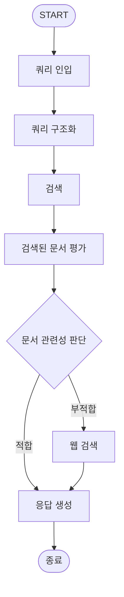

# 1. 소개
원하는 식당을 검색하고 식당에 관한 질의응답을 할 수 있는 LLM 에이전트 실습

<br>

# 2. 데이터
네이버 개발자 API를 사용해서 업체명과 주소를 수집하고, 네이버 지도 크롤링을 통해 메뉴, 리뷰, 업체소개 정보를 추가로 수집.

<br>

# 3. 흐름도(Flow Chart)



### 1. 쿼리 인입(Natural Language Query Input)
사용자가 입력한 질의가 시스템 입력으로 인입. 어떠한 가공도 되지 않은 자연어 형태로, 기계가 이해하기 쉬운 형태로 변형이 필요한 텍스트이다.

### 2. 쿼리 구조화(Query Rewrite)
검색시 입력한 자연어 쿼리를 검색에 용이한 형태로 구조화하는 단계. 여러가지 NLU(Natural Language Understanding - 자연어 이해) 기술 적용이 필요하다.

### 3. 검색(Retrieve)
구조화된 쿼리 및 벡터 검색을 통해 유저가 원하는 정보와 관련있는 문서를 찾는 단계이다. 단순히 자연어 쿼리 혹은 구조화된 쿼리를 임베딩한 이후 벡터 검색을 수행하는 기본적인 방식도 있으나, 다양한 특징으로 필터링을 수행하여 검색 대상 후보군 문서의 범위를 좁힐수록 검색 정확도가 올라간다.

### 4. 검색된 문서 평가(Relevance Grading)
자연어 질의와 검색된 문서를 성능이 좋은 LLM에 던져 검색된 문서가 유저의 질의에 답할 수 있는 정보를 충분히 가지고 있는지 평가하는 단계이다. 평가 결과에 따라 다음 프로세스가 결정된다.
연관 있음 -> 자연어 질의 및 검색된 문서를 하나의 컨텍스트로 하는 프롬프트를 작성하여 LLM에 응답 생성을 요청
연관 없음 -> 자연어 질의를 가지고 웹 검색을 수행하여 검색을 다시 수행한다. 웹은 로컬 데이터 스토어보다 더 풍부하고 일반적인 데이터를 가지고 있을 가능성이 크기 때문이다.

### 5. 웹 검색(Web Search)
가지고 있는 데이터 스토어에서 관련성 있는 문서가 없을 경우 웹 검색을 수행하여 다시 관련성 있는 정보를 찾는다. 개인이 사용하기에 [Tavily Search](https://tavily.com)라는 훌륭한 웹 검색 도구가 있다.

### 6. 응답 생성(Generation)
유저의 자연어 질의와 검색된 문서를 하나의 컨텍스트로 구성하여 LLM에 응답 생성을 요청한다.

<br>

# 4. 쿼리 구조화(Query Rewrite)

검색시 입력한 자연어 쿼리에서 핵심 정보를 추출해 검색에 적합한 구조화된 쿼리(Structured Query)로 변경하는 단계이다.

- 구조화된 쿼리의 필드
    - `location`: 위치 정보
        - `name`: 지역명(강남역, 정자동, 타임스퀘어)
        - `relation`: 관련성 (exact: 특정 식당명, nearby: 근처)
    - `cuisine`: 요리(예: 한식, 일식, 중식, 양식, 퓨전요리)
    - `menu`: 메뉴명(예: 국밥, 치킨, 회, 돈가스, 파스타)
    - `convenience`: 편의(예: 주차, 배달, 포장, 예약, 룸, 반려동물, 고기구워주는)
    - `atmosphere`: 분위기(예: 이국적인, 색다른, 로맨틱한)
    - `occasion`: 상황(예: 회식, 단체, 데이트, 혼밥, 가족)


예시 1) query: "강남역 주차되는 일식집"
```json
{
    "location": [{"name": "강남역", "relation": "nearby"}],
    "cuisine": ["일식"],
    "convenience": ["주차"]
}
```

> 예시 2) query: "판교 애견동반 식당"
```json
{
    "location": [{"name": "판교", "relation": "nearby"}],
    "convenience": ["반려동물"]
}
```

> 예시 3) query: "마포 진대감 주차되나요?"
```json
{
    "location": [{"name": "마포", "relation": "nearby"}, {"name": "진대감", "relation": "exact"}],
    "convenience": ["주차"]
}
```

> 예시 4) query: "조용히 대화할 수 있는 맥주집"
```json
{
    "menu": ["맥주"],
    "atmosphere": ["조용한"]
}
```

> 예시 5) query: "홍대에 회식하기 좋은 삼겹살집 추천해줘"
```json
{
    "location": [{"name": "홍대", "relation": "nearby"}],
    "menu": ["삼겹살"],
    "occasion": ["회식"],
}
```

구조화된 쿼리에서 `location`, `cuisine`, `menu`, `convenience`는 필수로 충족되어야 하는 성질의 조건이므로 필터링을 수행하는 용도로 사용하고, `atmosphere`, `occasion`은 점수 부스팅 용도로 사용함. 이러한 키워드 검색에 더불어 벡터 검색을 수행한다. 

<br>

# 5. 검색용 문서(Document) 생성

쿼리를 구조화한 이후 검색을 하기 위해서는 검색 대상이 되는 문서의 구조도 검색에 적합하게 설계해야 한다.

- 문서 필드
    - 크롤링으로 수집된 필드
        - `title`: 식당명
        - `address`: 주소
        - `roadAddress`: 도로명 주소
        - `menus`: 메뉴 목록
        - `reviews`: 사용자 리뷰 목록
        - `description`: 식당 소개글
        - `location`: 위치 정보. `title`(식당명), `address`(주소), `roadAddress`(도로명주소)를 합쳐서 생성
        - `food`: 요리, 메뉴 등 음식과 관련한 필드. 식당에서 등록한 `menu` 및  LLM을 사용해서 식당 리뷰에서 요리, 메뉴에 관한 필드를 추출해서 생성
    - LLM으로 추가 생성한 필드
        - `features`: 사용자가 검색어에 포함시킬 만한 키워드를 매칭하기 위한 필드. LLM을 사용해서 편의, 분위기, 상황과 관련된 맥락 키워드를 추출해서 생성
        - `embedding`: 위에서 생성한 정보들에서 임베딩 모델을 사용해서 벡터 생성

<br>

# 6. 검색 쿼리 <-> 문서 매칭 전략

- query: `location.name`
    - `location.relation`이 `exact`일 경우 문서의 `title` 대상으로 검색한다. 검색결과가 있을 경우 해당 식당 정보를 가져온다. 이렇게 되면 검색은 여기서 끝나고 유저의 자연어 질의어와 업체 정보를 컨텍스트로 묶어 LLM에 답변 요청을 생성한다.
    - `location.relation`이 `nearby`일 경우 네이버 검색 API를 활용해 해당 POI(Point Of Interest)를 검색한다. 예를들어 검색어가 '정자역'인 경우 네이버 검색 API에서 받아온 정자역의 위도, 경도를 중심으로 반경을 제한하는 geo 쿼리를 구조화된 쿼리에 추가하여 필터링을 수행한다.

- query: [`cuisine`, `menu`]
    - `cuisine`(양식, 중식, 일식 등)과 `menu`(치킨, 국밥 등)는 음식과 관련된 필드이므로 문서의 `food` 대상으로 필터링을 한다.

- query: `convenience` -> document: `features`
    - `convenience`는 필수적으로 만족해야 하는 조건이므로 문서의 `features`에 대해 필터링을 수행한다.

- query: `atmosphere`, `occasion`
    - 하드 필터링 하기에는 선택적 조건이라 생각된다. 따라서 검색에 직접적으로 사용하지 않는다. 자연어 질의에 해당 키워드가 포함되어있으므로 벡터 검색에 해당 조건이 잘 반영될 것이라 생각된다.

<br>

# 7. 벡터 데이터베이스

키워드 매칭 및 필터링이 필요하므로 크로마(Chroma), 어노이(Annoy) 처럼 설치없이 간단하게 사용할 수 있는 벡터 검색 라이브러리는 사용할 수 없다. 따라서 이미 오래 사용해서 익숙한 엘라스틱서치(Elasticsearch)를 도커 컨테이너로 띄워서 사용한다. 엘라스틱서치를 사용하면 Nori 형태소 분석기도 쉽게 사용할 수 있다는 것도 장점이다.
