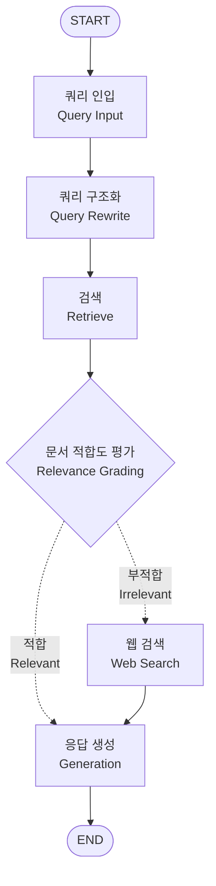

# 1. 소개
원하는 식당을 검색하고 식당에 관한 질의응답을 할 수 있는 LLM 에이전트 실습

<br>

# 2. 데이터 크롤링

네이버 개발자 API를 사용해서 업체명과 주소를 수집하고, 네이버 지도 크롤링을 통해 메뉴, 리뷰, 업체소개 정보를 추가로 수집.

- 최종 생성 문서 예시
```json
{
    "place_id": "1993900101",
    "search_keyword": "우드멜로우 서울특별시 강동구 아리수로",
    "title": "우드멜로우",
    "address": "서울특별시 강동구 고덕동 482",
    "roadAddress": "서울특별시 강동구 아리수로 243",
    "mapx": "1271551201",
    "mapy": "375630641",
    "menus": [
        {"name": "멜란자네파다노", "price": "20,000원"},
        {"name": "냉파스타(여름시즌한정)", "price": "17,500원"},
        {"name": "올리브 피칸테 엔쵸비", "price": "18,000원"},
        {"name": "클래식 까르보나라", "price": "19,000원"},
        {"name": "알리오올리오", "price": "18,000원"},
        {"name": "뽈로바질파스타", "price": "23,000원"},
        "(...줄임)"
    ],
    "reviews":
    [
        "우드멜로우에서 브런치를 즐기고 왔어요. 긴 테이블이 있어서 부모님과 여럿이 함께 앉기 편했어요. 창밖 경치도 좋아서 여유롭게 식사하기 좋은 공간이에요. 다양한 브런치 메뉴를 골라서 먹었는데, 전체적으로 음식이 맛있고 디저트류까지 구성이 다양해서 골라 먹는 재미가 있었어요. 다만 아쉬웠던 점은, 음식을 직접 받아서 엘리베이터 타고 올라가야 하는 구조인데 그릇이 꽤 무겁고 메뉴가 많다 보니 여러 번 나눠 옮겨야 했어요. 직원분들도 친절하고 음식도 만족스러웠던 만큼, 그 부분만 개선되면 훨씬 더 쾌적한 경험이 될 것 같아요.",
        "브런치 먹을만한 곳을 찾다가 오픈시간도 9시 30분이고 거리도 가까워서 와봤는데 브런치 메뉴가 정말 맛있네요 💯\n퀄리티도 좋고 흔히 볼수 있는데 메뉴가 아닌 색다른 메뉴들이 많더라구요 🥰\n세트메뉴 있는걸 모르고 주문했는데 친절히 알려주셔서 조금 더 착한 가격으로 든든하게 브런치 먹고 왔습니다\n또 방문할게요 ~!!",
        "인테리어가 너무 멋져서 사진이 잘 나와요\n메뉴도 다양하고 맛잇어서 너무 만족스러웠네요\n첫방문인데 앞으로 자주 오게 될 것 같아요😊👍🏻",
        "강동 최애 커피 & 파스타 맛집이에요!!\n신메뉴 가지 토스트 요리 (이름이 길어서 기억안나요ㅠ) 직원분이 추천해주셔서 먹어봤는데\n너무 맛있어요 ㅋㅋ\n가지도 많이 넣어주시고 잠봉햄도 조화가 좋아요.\n부모님도 맛있다고 하셨어요❤️\n즐거운 식사 시간이었어요. 또 올께요~~"
        "(...줄임)"
    ],
    "description": "예쁘고 편안한 공간에서 맛있는 커피와 브런치를 즐겨보세요 :)"
}
```

<br>

# 3. 흐름도(Flow Chart)



### 1. 쿼리 인입(Natural Language Query Input)
사용자가 입력한 질의가 시스템 입력으로 인입. 어떠한 가공도 되지 않은 자연어 형태로, 기계가 이해하기 쉬운 형태로 변형이 필요한 텍스트이다.

### 2. 쿼리 구조화(Query Rewrite)
검색시 입력한 자연어 쿼리를 검색에 용이한 형태로 구조화하는 단계. 여러가지 NLU(Natural Language Understanding - 자연어 이해) 기술 적용이 필요하다.

### 3. 검색(Retrieve)
구조화된 쿼리 및 벡터 검색을 통해 유저가 원하는 정보와 관련있는 문서를 찾는 단계이다. 단순히 자연어 쿼리 혹은 구조화된 쿼리를 임베딩한 이후 벡터 검색을 수행하는 기본적인 방식도 있으나, 다양한 특징으로 필터링을 수행하여 검색 대상 후보군 문서의 범위를 좁힐수록 검색 정확도가 올라간다.

### 4. 검색된 문서 평가(Relevance Grading)
자연어 질의와 검색된 문서를 성능이 좋은 LLM에 던져 검색된 문서가 유저의 질의에 답할 수 있는 정보를 충분히 가지고 있는지 평가하는 단계이다. 평가 결과에 따라 다음 프로세스가 결정된다.
연관 있음 -> 자연어 질의 및 검색된 문서를 하나의 컨텍스트로 하는 프롬프트를 작성하여 LLM에 응답 생성을 요청
연관 없음 -> 자연어 질의를 가지고 웹 검색을 수행하여 검색을 다시 수행한다. 웹은 로컬 데이터 스토어보다 더 풍부하고 일반적인 데이터를 가지고 있을 가능성이 크기 때문이다.

### 5. 웹 검색(Web Search)
가지고 있는 데이터 스토어에서 관련성 있는 문서가 없을 경우 웹 검색을 수행하여 다시 관련성 있는 정보를 찾는다. 개인이 사용하기에 [Tavily Search](https://tavily.com)라는 훌륭한 웹 검색 도구가 있다.

### 6. 응답 생성(Generation)
유저의 자연어 질의와 검색된 문서를 하나의 컨텍스트로 구성하여 LLM에 응답 생성을 요청한다.

<br>

# 4. 쿼리 구조화(Query Rewrite)

검색시 입력한 자연어 쿼리에서 핵심 정보를 추출해 검색에 적합한 구조화된 쿼리(Structured Query)로 변경하는 단계이다.

- 구조화된 쿼리의 필드
    - `location`: 위치 정보
        - `name`: 지역명(강남역, 정자동, 타임스퀘어)
        - `relation`: 관련성 (exact: 특정 식당명, nearby: 근처)
    - `cuisine`: 요리(예: 한식, 일식, 중식, 양식, 퓨전요리)
    - `menu`: 메뉴명(예: 국밥, 치킨, 회, 돈가스, 파스타)
    - `convenience`: 편의(예: 주차, 배달, 포장, 예약, 룸, 반려동물, 고기구워주는)
    - `atmosphere`: 분위기(예: 이국적인, 색다른, 로맨틱한)
    - `occasion`: 상황(예: 회식, 단체, 데이트, 혼밥, 가족)


> 예시 1) query: "강남역 주차되는 일식집"
```json
{
    "location": [{"name": "강남역", "relation": "nearby"}],
    "cuisine": ["일식"],
    "convenience": ["주차"]
}
```

> 예시 2) query: "판교 애견동반 식당"
```json
{
    "location": [{"name": "판교", "relation": "nearby"}],
    "convenience": ["반려동물"]
}
```

> 예시 3) query: "마포 진대감 주차되나요?"
```json
{
    "location": [{"name": "마포", "relation": "nearby"}, {"name": "진대감", "relation": "exact"}],
    "convenience": ["주차"]
}
```

> 예시 4) query: "조용히 대화할 수 있는 맥주집"
```json
{
    "menu": ["맥주"],
    "atmosphere": ["조용한"]
}
```

> 예시 5) query: "홍대에 회식하기 좋은 삼겹살집 추천해줘"
```json
{
    "location": [{"name": "홍대", "relation": "nearby"}],
    "menu": ["삼겹살"],
    "occasion": ["회식"],
}
```

구조화된 쿼리에서 `location`, `cuisine`, `menu`, `convenience`는 필수로 충족되어야 하는 성질의 조건이므로 필터링을 수행하는 용도로 사용하고, `atmosphere`, `occasion`은 점수 부스팅 용도로 사용함. 이러한 키워드 검색에 더불어 벡터 검색을 수행한다. 

<br>

# 5. 검색용 문서(Document) 생성

### 1. 크롤 문서 전처리
1. 가격을 숫자로 변환

텍스트로 표현된 가격(`menu.price`)을 정수로 변환한다.(ex. "20,000원" -> 20000)

2. 위도, 경도 실수로 변환

`x`: `mapx`에서 앞 세 자리를 정수부, 뒷부분을 소수부로 한 소수로 변환(ex. "1271551201" -> 127.155120)
`y`: `mapy`에서 앞 두 자리를 정수부, 뒷부분을 소수부로 한 소수로 변환(ex. "375630641" -> 37.563064)

### 2. 리뷰와 식당 설명으로부터 추가 정보 추출

LLM을 사용해서 리뷰(`reviews`)와 식당 설명(`description`)에서 다음의 추가적인 정보를 추출한다.
- `review_food`: 리뷰에서 추출한 요리, 음식 관련 키워드. 크롤링한 식당 필드에도 `cuisine`, `menu`가 이미 있지만 리뷰에서 더 풍부한 키워드 추출.
- `convenience`: 편의(예: 주차, 배달, 포장, 예약, 룸, 반려동물, 고기구워줌 등)
- `atmosphere`: 분위기(예: 이국적인, 색다른, 로맨틱한 등)
- `occasion`: 상황(예: 회식, 단체, 데이트, 혼밥, 가족 등)
- `features`: 기타 특징(예: 넓은공간, 창가뷰, 방송출연(프로그램명), 유명인 이름, 주변 장소 등)

### 3. 임베딩을 위한 `summary` 필드 생성

임베딩을 추출하기 위해 식당 관련 내용을 요약한 단 하나의 텍스트 필드(`summary`)를 생성한다.

```python
summary = f"""
식당 이름: {title}
주소: {address}({roadAddress)}
메뉴: {",".join(menus + review_food)}
f"편의: {','.join(convenience) if convenience else None}"
f"분위기: {','.join(atmosphere) if atmosphere else None}"
f"상황: {','.join(occasion) if occasion else None}"
f"기타 특징: {','.join(features) if features else None}"
"""
```

### 4. 임베딩 추출

`summary` 텍스트로부터 임베딩을 추출한다.

최종적으로 아래와 같은 구조의 식당 문서를 생성한다.

```json
{
    "title": "식당명",
    "address": "주소",
    "roadAddress": "도로명주소",
    "menus": "메뉴",
    "lat": "위도",
    "lon": "경도",
    "reviews": "리뷰",
    "description": "소개",
    "review_food": "리뷰에서 추출한 요리",
    "convenience": "편의",
    "atmosphere": "분위기",
    "occasion": "상황",
    "features": "기타 특징",
    "summary": "요약",
    "embedding": "임베딩"
}
```

### 5. 최종 문서 예시

```json
{
    "place_id": "38010856",
    "title": "마미손빈대떡,생선구이,오리구이",
    "address": "서울특별시 송파구 가락동 87 유일빌딩 1층 마미손빈대떡",
    "roadAddress": "서울특별시 송파구 중대로9길 50 유일빌딩 1층 마미손빈대떡",
    "lat": 37.4971191,
    "lon": 127.1194978,
    "menus":
    [
        {
            "name": "오리로스구이(한마리)",
            "price": 57000
        },
        {
            "name": "양념게장정식+된장찌개(1인분)",
            "price": 10000
        },
        {
            "name": "모듬전+김치찌개",
            "price": 38000
        },
        {
            "name": "모듬전",
            "price": 35000
        },
        {
            "name": "생선모듬구이(중)",
            "price": 35000
        },
        {
            "name": "갈치조림(대)",
            "price": 40000
        },
        "(...줄임)"
    ],
    "reviews":
    [
        "회사근처 맛집으로 자주 왔는데 리모델링해서 매장이 훨씬 넓고 쾌적해졌어요 원래도 어머님 솜씨조으셔서 맛있는데 더 맛집이 되었네요^^\n일상적인 점심식사도 훌륭하고 모듬전 및 안주류에 술한잔 하기도 좋은 곳이에요\n저의 추천은 모듬전과 볶음류 양념맛이 너무 조아요",
        "리모델링하고 새로운메뉴가 생겼네요\n오리로스구이랑 탕이 세트로 나오는데\n깔끔하니 맛있었어요",
        "비가 오면 무조건 생각나는 부칭개에 막걸리.\n비오는 날이면 생각나는 마미손빈대떡.\n오랜만에 비가와서 들렀더니 리뉴얼을 해버렸네.\n예전엔 선술집 같은 느낌이었는디 깔끔하게 리뉴얼 했다.\n아직 간판도 안달았는데 영업을 하고 있었다는~~\n거기에 손님이 이미 꽉 차서 시끌시끌 하더라.\n맛은 전혀 변함이 없고 친철한 서비스도 그대로다.\n거기에 주변 부칭개집보다 가성비까지 여전하다.\n이러니 사람들이 다시 찾아오지.\n비오는날 부칭개는 마미손부칭개(빈대떡)!!!\n다시 방문 하고싶은 마음 50,000%",
        "고등어구이 맛집이예요!! 고등어뿐 아니라~ 다양한 메뉴가 많은데요! 다~ 맛탱!! 가락동에 찐 단골집입니다.\n이번에 신메뉴~ 양념게장! 맛도리네요!\n다음엔 양념게장정식으로 먹어야겠어요.👍",
        "오리탕빼고 너~~무너무맘에들어요!!!",
        "(...줄임)"
    ],
    "description": "매일 신선하고 맛있는 음식으로 최선을 다해 준비하고 있습니다.\n\n요일별 특별반찬 메뉴가 있습니다.\n(총 반찬 5가지 제공)\n\n(김치,나물,샐러드,계란말이,특별반찬)\n\n요일 특별반찬\n월(장조림) 화(잡채) 수(게장) 목(쏘세지야채볶음) 금(동그랑땡) 토(게장)\n\n재오픈 리뉴얼오픈기념\n\n2025년7월31일까지 양념게장 정식을 10,000에 판매합니다.",
    "review_food": ["모듬전", "부침개", "빈대떡", "오리로스구이", "오리탕", "양념게장", "고등어구이", "제육볶음", "파전", "김치전"],
    "convenience": ["주차", "포장"],
    "atmosphere": ["넓은 공간", "쾌적한", "시끌벅적한"],
    "occasion": ["점심식사", "회식", "술자리", "모임", "가족"],
    "features": ["가성비", "친절한", "방송출연", "신메뉴", "리뉴얼", "요일별 특별반찬"],
    "summary": "식당 이름: 마미손빈대떡,생선구이,오리구이\n주소: 서울특별시 송파구 가락동 87 유일빌딩 1층 마미손빈대떡(서울특별시 송파구 중대로9길 50 유일빌딩 1층 마미손빈대떡)\n메뉴: 오리로스구이(한마리),양념게장정식+된장찌개(1인분),모듬전+김치찌개,모듬전,생선모듬구이(중),갈치조림(대),고등어구이+된장찌개(1인분),노르웨이고등어구이+된장찌개(1인분),가자미구이+된장찌개(1인분),임연수구이+된장찌개(1인분),갈치구이+된장찌개(1인분),오징어볶음+된장찌개(2인분),해물파전,굴전(계절메뉴),동그랑땡,동태전,깻잎전,고추전,감자전,부추전,김치전,호박전,두부전,닭볶음탕,가오리찜,홍어회,어리굴젓,계란말이,구룡포과메기(계절메뉴),꼬막데침(계절메뉴),꼬막간장(계절메뉴),생굴(계절메뉴),생선모듬구이(대),조기구이,갈치조림(중),고등어조림(중),고등어조림(대),삼치구이+된장찌개(1인분),제육볶음+된장찌개(2인분),김치찌개(2인분),부대찌개(2인분),알탕(2인분),동태탕(2인분),조기매운탕(2인분),생대구탕(2인분),모듬전,부침개,빈대떡,오리로스구이,오리탕,양념게장,고등어구이,제육볶음,파전,김치전\n편의: 주차,포장\n분위기: 넓은 공간,쾌적한,시끌벅적한\n상황: 점심식사,회식,술자리,모임,가족\n기타 특징: 가성비,친절한,방송출연,신메뉴,리뉴얼,요일별 특별반찬",
    "embedding":
    [
        -0.028949551279472147,
        -0.0017396338291416917,
        0.03168854535716604,
        -0.10113728714514654,
        (...줄임)
    ]
}
```

<br>

# 6. 검색 쿼리 <-> 문서 매칭 전략

- query: `location.name`
    - `location.relation`이 `exact`일 경우 문서의 `title` 대상으로 검색한다. 검색결과가 있을 경우 해당 식당 정보를 가져온다. 이렇게 되면 검색은 여기서 끝나고 유저의 자연어 질의어와 업체 정보를 컨텍스트로 묶어 LLM에 답변 요청을 생성한다.
    - `location.relation`이 `nearby`일 경우 네이버 검색 API를 활용해 해당 POI(Point Of Interest)를 검색한다. 예를들어 검색어가 '정자역'인 경우 네이버 검색 API에서 받아온 정자역의 위도, 경도를 중심으로 반경을 제한하는 geo 쿼리를 구조화된 쿼리에 추가하여 필터링을 수행한다.

- query: [`cuisine`, `menu`]
    - `cuisine`(양식, 중식, 일식 등)과 `menu`(치킨, 국밥 등)는 음식과 관련된 필드이므로 문서의 `menus.name`, `review_food` 대상으로 필터링을 한다.

- query: `convenience` -> document: `convenience`
    - `convenience`는 필수적으로 만족해야 하는 조건이므로 문서의 `convenience`에 대해 필터링을 수행한다.

- query: `atmosphere`, `occasion`
    - 하드 필터링 하기에는 선택적 조건이라 생각된다. 따라서 검색에 직접적으로 사용하지 않는다. 자연어 질의에 해당 키워드가 포함되어있으므로 벡터 검색에 해당 조건이 잘 반영될 것이라 생각된다.

- 쿼리 예시
1. 자연어 질의: "강남역 주차되는 일식집"
2. 쿼리 구조화:
```json
{
    "location": [{"name": "강남역", "relation": "nearby"}],
    "convenience": ["주차"],
    "cuisine": ["일식"],
}
```
3. 네이버 검색 API에서 강남역 검색 후 x, y 좌표 가져오기
4. embedding: 쿼리임베딩("강남역 주차되는 일식집")
5. 최종 엘라스틱서치 쿼리
```json
{
    "knn": {
        "field": "embedding",
        "query_vector": embedding,
        "k": 5,
        "num_candidates": 100,
        "filter": [
            {
                "geo_distance": {
                    "distance": "3km",
                    "location": {
                        "lat": y,
                        "lon": x
                    }
                }
            },
            {
                "match": {
                    "query": "주차",
                    "operator": "and"
                }
            },
            {
                "bool": {
                    "should": [
                        {
                            "nested": {
                                "path": "menus",
                                "query": {
                                    "match": {
                                        "menus.name": {
                                            "match": {
                                                "query": "일식",
                                                "operator": "and"
                                            }
                                        }
                                    },
                                }
                            },
                        },
                        {
                            "review_food": {
                                "match": {
                                    "query": "일식",
                                    "operator": "and"
                                }
                            }
                        }
                    ],
                    "minimum_should_match": 1
                }
            }
        ]
    },
    "size": 5,
}
```

<br>

# 7. 벡터 데이터베이스

키워드 매칭 및 필터링이 필요하므로 단순 벡터 유사도 검색만 지원하는 크로마(Chroma), 어노이(Annoy) 처럼 설치없이 간단하게 사용할 수 있는 벡터 검색 라이브러리는 사용할 수 없다. 키워드 검색/필터 기능 및 위치 기반 근거리 검색을 위해 엘라스틱서치(Elasticsearch)를 사용한다. 
